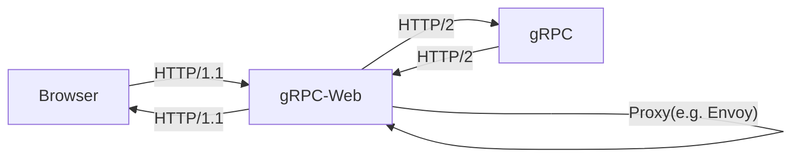

---
tags:
  - technology
  - grpc
  - protobuf
title: gRPC
---
## gRPC / protobuf
gPRCは [protobuf](https://github.com/protocolbuffers/protobuf) を利用しており、効率的なデータシリアライゼーションを可能にしている。

#### 効率的なデータシリアライゼーションとは？
- データサイズが小さい：バイナリなので、JSONやXMLより小さいサイズで表現可能。ネットワーク上の転送速度が高速に。
- パース速度が高速：バイナリ形式なのでJSONとXMLよりパース（データ読み込み・解釈）が高速
- 言語互換性：多くの言語で利用可能＝対応言語間で用意にやり取り可能
- スキーマによる型安全：データ形式をスキーマで定義することにより、構造と型が明示され、間違ったデータ形式を防ぐ。

## Connectとは

弊社CTO記事を拝読するのがよいのだが

https://www.awarefy.dev/blog/better-grpc-connect-go/
https://buf.build/blog/connect-a-better-grpc
https://connect.build/docs/introduction/?ref=awarefy.dev#seamless-multi-protocol-support

Connectにすることで、gRPC, Connect, gRPC-Webの３つのプロトコルをサポート[^5]され、gRPC-Webの場合に（Envoyなどの）プロキシが必要だったが、それが不要になる。
[^5]: https://www.awarefy.dev/blog/better-grpc-connect-go/

Connectプロトコル：HTTP/1.1またはHTTP/2で動作する、gRPCでも動作し、gRPC-Webでも動作します。
gRPC-Webプロトコル：gRPC通信をWebで利用するためのプロトコル。ブラウザでも動作するように制限に合わせたプロトコル定義。

## なぜgRPC-WebではEnvoy が必要になるのか？

主要なブラウザはHTTP/2をサポートしている。しているのだがHTTP/2で通信する場合はHTTP/2で通信、そうでない場合は勝手にHTTP/1.1にフォールバックするとのこと。つまりWEBブラウザからの通信にはHTTP/2での通信であることを担保することができない。これにより、HTTP/1.1での通信をプロキシがHTTP/2にトレースすることでgRPCサーバーと通信をすることが可能になり、プロキシが必要な理由である。

EnvoyはgRPC-Webのプロキシとして使用されるツールの一つである。
gRPC-WebのリクエストをgRPCリクエスト（HTTP/2）に変換し、gRPCサーバへ転送する。

https://symthy.hatenablog.com/entry/2022/09/24/160309

Connectは前述したとおり、
> Connectにすることで、gRPC, Connect, gRPC-Webの３つのプロトコルをサポート[^5]され、gRPC-Webの場合に（Envoyなどの）プロキシが必要だったが、それが不要になる。

ということでプロキシが担っていた役割もConnectが果たしており、プロキシなしでのWebからのgRPC通信が可能になった。

--- 
alse see: https://zenn.dev/link/comments/6f9118d0279c18
